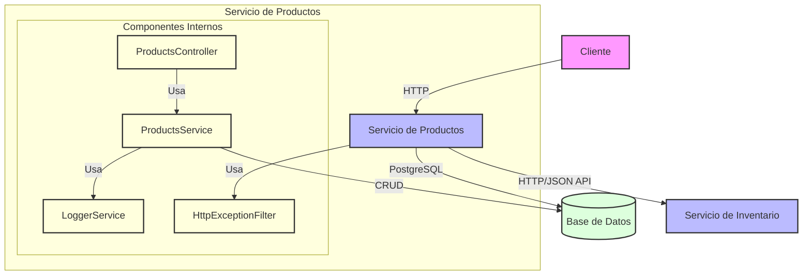

# Microservicios de Productos

Este proyecto implementa una solución basada en microservicios para la gestión de productos. La arquitectura está compuesta por dos microservicios independientes que se comunican entre sí mediante peticiones HTTP siguiendo el estándar JSON API.

## Tabla de contenidos

- [Arquitectura](#arquitectura)
- [Tecnologías utilizadas](#tecnologías-utilizadas)
- [Requisitos previos](#requisitos-previos)
- [Instalación y ejecución](#instalación-y-ejecución)
- [Estructura del proyecto](#estructura-del-proyecto)
- [Endpoints de la API](#endpoints-de-la-api)
- [Comunicación entre servicios](#comunicación-entre-servicios)
- [Decisiones técnicas](#decisiones-técnicas)
- [Pruebas](#pruebas)
- [Consideraciones de seguridad](#consideraciones-de-seguridad)
- [Mejoras futuras](#mejoras-futuras)

## Arquitectura

La solución está compuesta por dos microservicios independientes:

1. **Microservicio de Productos**: Gestiona la información básica de los productos (id, nombre, precio).
2. **Microservicio de Inventario**: Gestiona la cantidad disponible de cada producto, consultando la información del producto al microservicio de Productos.

### Diagrama de arquitectura



## Tecnologías utilizadas

- **Backend**: 
  - NestJS (Node.js)
  - TypeScript
  - TypeORM
  - PostgreSQL
  - JSON API

- **Documentación**:
  - Swagger/OpenAPI

- **Contenedores**:
  - Docker
  - Docker Compose

- **Pruebas**:
  - Jest

## Requisitos previos

- Node.js (v14 o superior)
- Docker y Docker Compose
- Git

## Instalación y ejecución

### Usando Docker (recomendado)

1. Clonar el repositorio:
   ```bash
   git clone https://github.com/tu-usuario/product-service.git
   cd product-service
   ```

2. Iniciar los servicios con Docker Compose:
   ```bash
   docker-compose up -d
   ```

3. Los servicios estarán disponibles en:
   - Servicio de Productos: http://localhost:3000
   - Documentación Swagger de Productos: http://localhost:3000/api/docs

### Ejecución local (desarrollo)

#### Microservicio de Productos

1. Configurar variables de entorno:
   ```bash
   cd product-service
   cp .env.example .env
   ```

2. Instalar dependencias:
   ```bash
   npm install
   ```

3. Iniciar en modo desarrollo:
   ```bash
   npm run start:dev
   ```

#### Microservicio de Inventario

1. Configurar variables de entorno:
   ```bash
   cd inventory-service
   cp .env.example .env
   ```

2. Instalar dependencias:
   ```bash
   npm install
   ```

3. Iniciar en modo desarrollo:
   ```bash
   npm run start:dev
   ```


## Endpoints de la API

### Microservicio de Productos

- `GET /products`: Listar todos los productos con paginación
  - Query params: `page`, `limit`
- `GET /products/:id`: Obtener un producto por ID
- `POST /products`: Crear un nuevo producto
- `PATCH /products/:id`: Actualizar un producto
- `DELETE /products/:id`: Eliminar un producto

## Comunicación entre servicios

La comunicación entre el microservicio de Inventario y el de Productos se realiza mediante peticiones HTTP con las siguientes características:

- **Autenticación**: Mediante API Keys (encabezado `x-api-key`)
- **Formato**: JSON API para solicitudes y respuestas
- **Manejo de errores**: Timeout y reintentos para gestionar fallos de comunicación
- **Eventos**: El microservicio de Inventario emite eventos cuando el inventario cambia

## Decisiones técnicas

### Base de datos

Se eligió PostgreSQL por las siguientes razones:
- Integridad referencial: Importante para mantener las relaciones entre productos e inventario
- Soporte transaccional: Necesario para operaciones atómicas
- Buen soporte en TypeORM: Facilita el desarrollo y mantenimiento
- Escalabilidad: Adecuada para el volumen de datos esperado

### Estándar JSON API

Se implementó este estándar para:
- Proporcionar una experiencia coherente entre los microservicios
- Facilitar la paginación y las relaciones entre recursos
- Estandarizar el formato de errores
- Mejorar la documentación y comprensión de las API

### Logs estructurados

Se implementó un sistema de logs estructurados para:
- Facilitar el diagnóstico de problemas
- Mejorar la observabilidad
- Registrar información importante de manera consistente

### Manejo de excepciones

Se implementaron filtros de excepciones para:
- Estandarizar las respuestas de error
- Seguir el formato JSON API
- Registrar adecuadamente los errores

## Pruebas

### Ejecución de pruebas

```bash
# Pruebas unitarias
npm run test

# Pruebas de cobertura
npm run test:cov
```

### Estrategia de pruebas

- **Pruebas unitarias**: Para validar la lógica de negocio de cada servicio
- **Pruebas de integración**: Para validar la comunicación entre microservicios
- **Pruebas e2e**: Para validar el flujo completo desde el punto de vista del cliente

## Consideraciones de seguridad

- **API Keys**: Protegen la comunicación entre microservicios
- **Validación de datos**: Se implementa validación de datos de entrada en ambos servicios
- **Configuración de CORS**: Restricciones de origen para prevenir ataques
